# Obligatorio 2 Taller de Programación

**Integrantes:**

- Esteban Moroy - Nro. Estudiante 338885
- Bruno Riera - Nro. Estudiante 342022
- Ignacio Martínez - Nro. Estudiante 263891

**Grupo: N1B**

**Problema Elegido: Nro. 28**

[Link al repositorio](https://github.com/estebanmoroy/obligatorio-1-taller)

## Tabla de Contenido

- [Obligatorio 2 Taller de Programación](#obligatorio-2-taller-de-programación)
  - [Tabla de Contenido](#tabla-de-contenido)
  - [Presentación](#presentación)
    - [Presentación del problema](#presentación-del-problema)
    - [¿Qué es GitHub?](#qué-es-github)
    - [¿Qué es GitHub Issues?](#qué-es-github-issues)
    - [¿Para qué sirven los GitHub Issues?](#para-qué-sirven-los-github-issues)
    - [Buenas Prácticas](#buenas-prácticas)
  - [Generar un repositorio de git local y subir a GitHub](#generar-un-repositorio-de-git-local-y-subir-a-github)
    - [Crear un repositorio en GitHub](#crear-un-repositorio-en-github)
    - [Opcional - Configurar clave SSH](#opcional---configurar-clave-ssh)
  - [Crear un template de GitHub Issue en formato MarkDown (.md)](#crear-un-template-de-github-issue-en-formato-markdown-md)
  - [Crear un template de GitHub Issue en formato Yaml (.yml)](#crear-un-template-de-github-issue-en-formato-yaml-yml)
  - [Fuentes](#fuentes)

## Presentación

### Presentación del problema

28. Problema:
    La empresa necesita de un mejor seguimiento acerca del reporte de problemas y
    mejoras en la documentación y el código, así como los bugs en su código.

Solución:
En un repositorio en GitHub, implementar “templates” de GitHub Issues para al
menos los siguientes diferentes tipos de reportes:

- Documentación
- Mejoras
- Pedido de nueva funcionalidad (Feature request)
- Bugs

Debe investigar buenas prácticas y elementos a incluir para cada tipo de reporte, así
como ejemplificar con al menos 2 reportes cada categoría. Para el código, puede
servirse de su entrega del Obligatorio 1, a la cual puede realizarle modificaciones.

### ¿Qué es GitHub?

GitHub es una plataforma de desarrollo colaborativo para alojar proyectos utilizando el sistema de control de versiones Git. GitHub permite a los desarrolladores trabajar en proyectos en equipo, compartir código, rastrear cambios y colaborar en el desarrollo de software.

### ¿Qué es GitHub Issues?

GitHub Issues es una herramienta dentro de un repositorio de GitHub, consiste en un registro para discutir cualquier aspecto del proyecto. Cada issue tiene su propio hilo de discusión, donde los colaboradores pueden comentar, adjuntar archivos y linkear código relacionado. Los issues pueden incluir:

- Bugs: Reportes de errores o problemas en el código.
- Tareas: Tareas que necesitan completarse.
- Mejoras: Solicitudes de nuevas características o mejoras a las existentes.
- Preguntas: Preguntas o discusiones sobre el proyecto.

### ¿Para qué sirven los GitHub Issues?

Seguimiento de Errores (Bugs): Permiten a los usuarios y desarrolladores reportar errores que encuentran en el software, describirlos en detalle y proporcionar pasos para reproducirlos. Esto ayuda al equipo de desarrollo a identificar y solucionar problemas.

Planificación de Características: Ayudan a organizar y priorizar nuevas características o mejoras. Los colaboradores pueden discutir cómo implementar una nueva característica, sugerir cambios y asignar tareas específicas a los miembros del equipo.

Gestión de Proyectos: Facilitan la gestión de proyectos al permitir que las tareas se dividan en issues individuales, que luego pueden ser asignados a diferentes colaboradores. Esto proporciona una visión clara del progreso y lo que aún queda por hacer.

Discusión y Colaboración: Fomentan la discusión y colaboración entre los miembros del equipo. Los issues permiten que todos los involucrados en el proyecto contribuyan con ideas, revisen el trabajo de otros y propongan soluciones.

Documentación de Decisiones: Actúan como un registro de las decisiones tomadas durante el desarrollo del proyecto. Esto es útil para referirse en el futuro y entender por qué se tomaron ciertas decisiones.

Automatización: Pueden integrarse con otras herramientas y servicios de GitHub, como GitHub Actions, para automatizar flujos de trabajo. Por ejemplo, un issue puede cerrarse automáticamente cuando se fusiona un pull request que soluciona el problema descrito en el issue.

### Buenas Prácticas

- **Estandarización de títulos:** Utilizar títulos claros y consistentes facilita la identificación rápida del problema o la mejora solicitada.
- **Pasos reproducibles:** Proporcionar pasos detallados para reproducir el problema permite a los desarrolladores entender exactamente cómo se puede manifestar el error o la necesidad de mejora.
- **Uso de etiquetas (Labels):** Las etiquetas categorizan los issues según su tipo (bug, mejora, documentación), estado (abierto, en progreso, cerrado) o prioridad (alta, media, baja), lo que ayuda a priorizar y gestionar eficazmente el trabajo.
- **Priorización e impacto:** Especificar la prioridad y el impacto del problema o la mejora ayuda a los equipos a asignar recursos adecuadamente y abordar primero los elementos más críticos.
- **Descripciones detalladas:** Proporcionar descripciones completas y detalladas del problema o la mejora solicitada ayuda a los desarrolladores a entender el contexto y la naturaleza del cambio necesario.
- **Alternativas consideradas:** Incluir alternativas o enfoques sugeridos muestra que se ha pensado de manera crítica sobre la solución y puede llevar a discusiones más informadas sobre la mejor manera de abordar el problema.
- **Contexto y justificación:** Explicar el contexto en el que se produce el problema o la razón por la cual se necesita la mejora proporciona una comprensión más profunda a los desarrolladores y a otros interesados.
- **Documentación completa:** Mantener la documentación actualizada y accesible asegura que todos los miembros del equipo estén informados y puedan colaborar eficazmente en la resolución de problemas y mejoras.

## Generar un repositorio de git local y subir a GitHub

1. Crear un repositorio de git local en la carpeta del proyecto

```bash
git init
```


2. Agregar los archivos al repositorio

```bash
git add .
```

3. Agregar .gitignore para los archivos que se generan durante la ejecución

```bash
touch .gitignore
echo "usuarios.txt" >> .gitignore
echo "informe.txt" >> .gitignore
```


4. Crear un commit

```bash
git commit -m "Primer Commit"
```


### Crear un repositorio en GitHub

5.1 En la página principal de GitHub, una vez logueados, clickear en "New"


5.2 Darle un nombre al repositorio


5.3 Darle una descripción al repositorio


5.4 Clickear en "Crear Nuevo Repositorio"
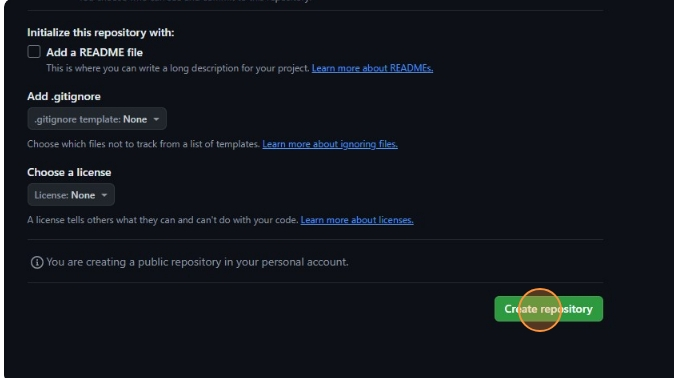

5.5 En la sección de "Quick setup" seleccionar la opción SSH


5.6 Copiar la dirección SSH
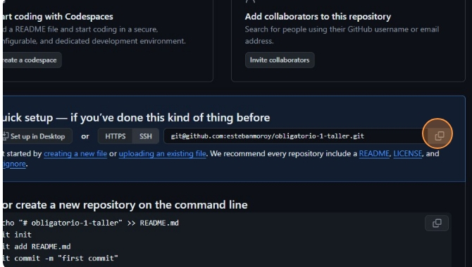

5.7 Agregar la dirección SSH del repositorio remoto copiada

```bash
git remote add origin
```

### Opcional - Configurar clave SSH

En caso de que no se tenga configurada una clave de autenticación remota SSH, se muestran los pasos para configurar una.
Se realizó siguiendo instructivo publicado en GitHub:

[Generación de una nueva clave SSH y adición al agente SSH](https://docs.github.com/es/authentication/connecting-to-github-with-ssh/generating-a-new-ssh-key-and-adding-it-to-the-ssh-agent)

6.1 Generar llave SSH con el correo electrónico registrado en GitHub

```bash
ssh-keygen -t ed25519 -C "your_email@example.com"
```

6.2 Cuando se pida, escribir una frase segura como contraseña
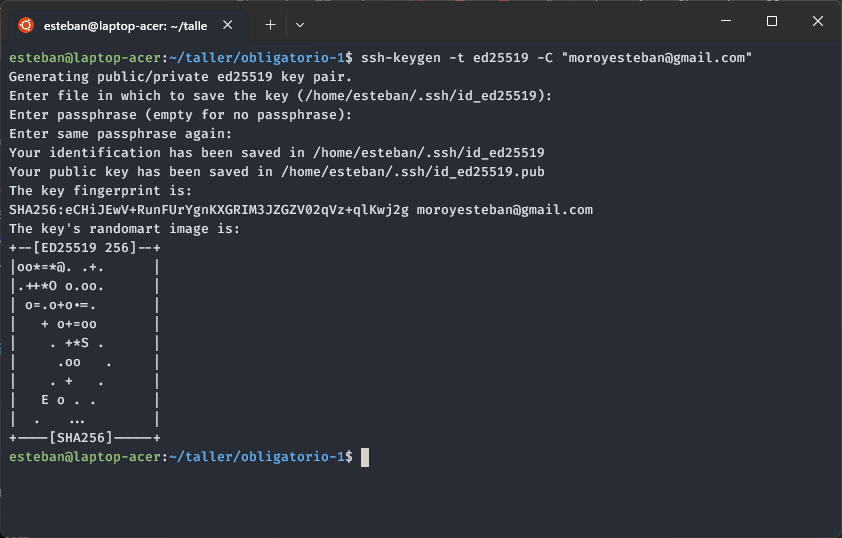

6.3 Verificar si la clave se generó correctamente

```bash
$ eval "$(ssh-agent -s)"
```


6.4 Agregar la llave al ssh-agent

```bash
ssh-add ~/.ssh/id_ed25519
```


6.5 En la sección de usuario de GitHub, dirigirse a Settings


6.6 Seleccionar "Llaves SSH y GPG"


6.7 Seleccionar "Nueva llave SSH"
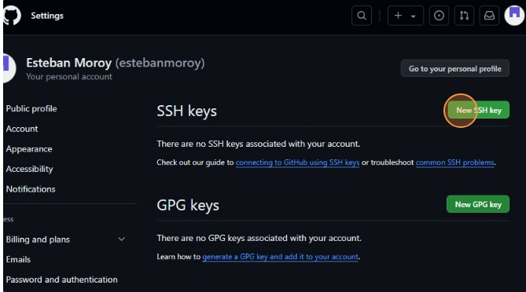

6.8 Agregar un nombre a la llave


6.9 En consola usar el comando debajo y pegar el resultado en el campo "Llave"

```bash
cat ~/.ssh/id_ed25519.pub
```

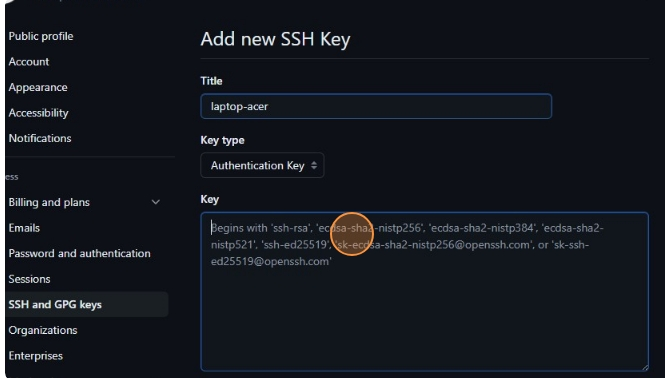

6.10 Seleccionar "Agregar llave SSH"


6.11 Subir los archivos al repositorio remoto

```bash
git push -u origin master
```


6.12 Verificar que se agregaron los archivos correctamente


## Crear un template de GitHub Issue en formato MarkDown (.md)

1. En la página del repositorio dirigirse a la pestaña Settings
   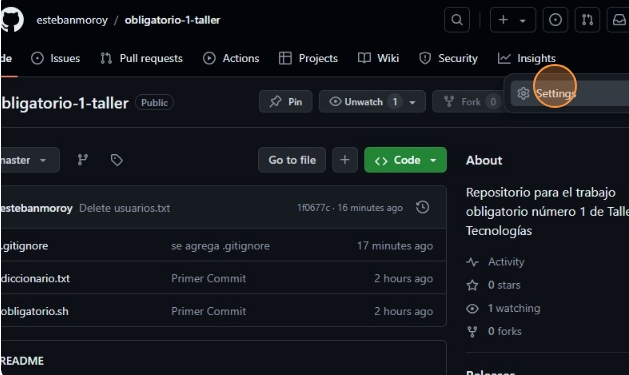

2. En la sección de Issues, seleccionar Configurar Templates
   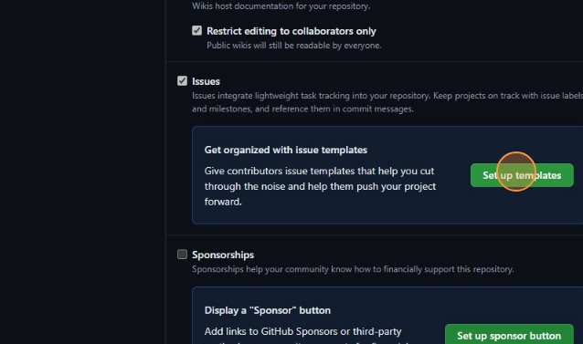

3. Seleccionar el tipo de template a configurar
   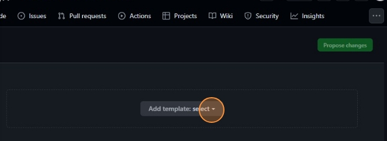
   

4. Seleccionar Preview y Editar
   

5. Clickear en el ícono del lápiz para editar el template
   

6. Agregar el contenido del template deseado
   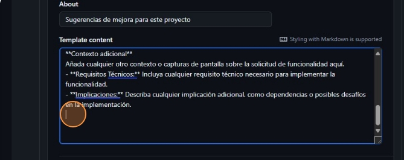

7. También se pueden agregar títulos por defecto y etiquetas
   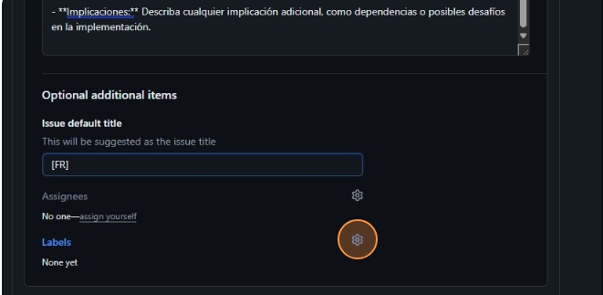

8. Se puede seleccionar alguna de las etiquetas predeterminadas
   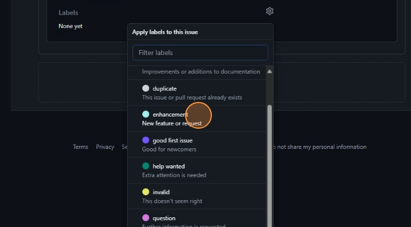
   

9. O agregar una nueva customizada
   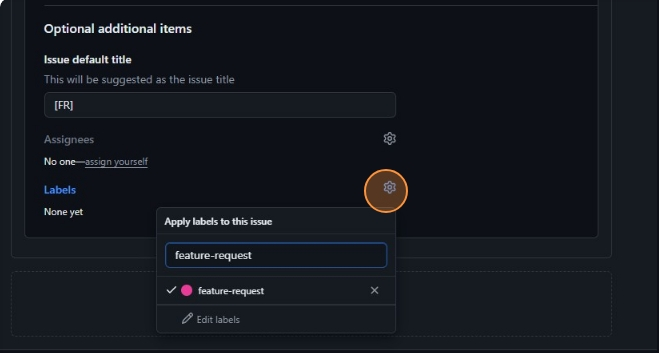

10. Luego de finalizado clickear en Proponer cambios
    

11. Esto genera un commit con el template generado en formato MarkDown
    

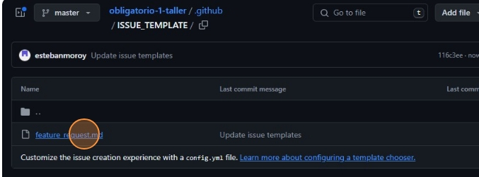

## Crear un template de GitHub Issue en formato Yaml (.yml)

En caso de que se desee un mayor nivel de personalización, se pueden configurar los templates de Issues en formato Yaml, los cuales permiten generar campos específicos, listas desplegables, checkboxes, entre otros.

Pasos a seguir:

1. Actualizar el repositorio para traer los últimos cambios del servidor

```bash
git pull
```

2. Luego dirigirse a la carpeta .github/ISSUE_TEMPLATE/
   

3. Generar un archivo para el template, en este caso se llama "feature_request.yml"

```bash
touch feature_request.yml
```

4. Escribir en el archivo siguiendo la conveción para formularios de GitHub:
   [Syntax for GitHub's form schema](https://docs.github.com/en/communities/using-templates-to-encourage-useful-issues-and-pull-requests/syntax-for-githubs-form-schema)


5. Eliminar el archivo .md anteriormente generado

```bash
git rm feature_request.md
```

6. Y agregar el nuevo archivo .yml generado

```bash
git add feature_request.yml
```

7. Crear un commit para confirmar los cambios y pushearlos al repositorio

```bash
git commit -m "Se agrega archivo .yml para las Feature Requests
git push origin master
```

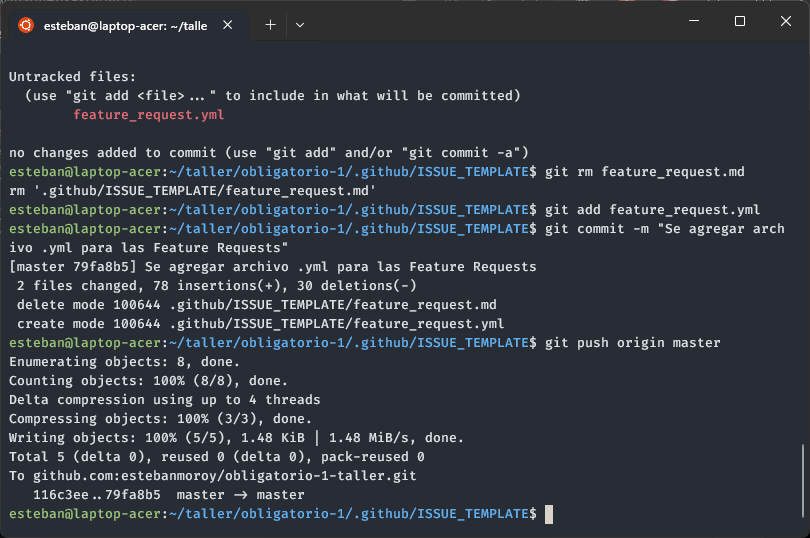

8. Verificar cambios generando un nuevo Issue
   

Ahora el formulario cuenta con varios campos de texto para cada sección solicitada


## Fuentes

[YouTube - Github Issue Templates: A Look at the New Issue Templates](https://www.youtube.com/watch?v=o3E3LwzhLcc)

[GitHub - Configuring issue templates for your repository](https://docs.github.com/en/communities/using-templates-to-encourage-useful-issues-and-pull-requests/configuring-issue-templates-for-your-repository)

[GitHub - Syntax for GitHub's form schema](https://docs.github.com/en/communities/using-templates-to-encourage-useful-issues-and-pull-requests/syntax-for-githubs-form-schema)
